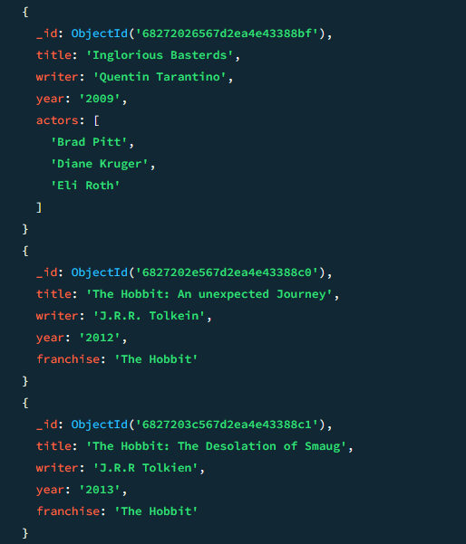
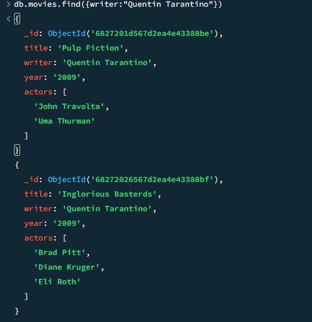
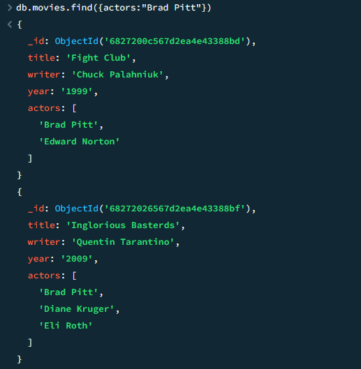
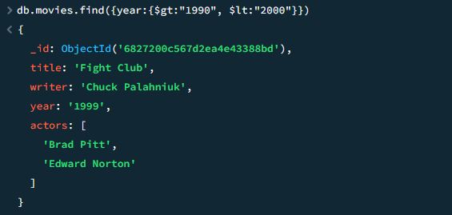
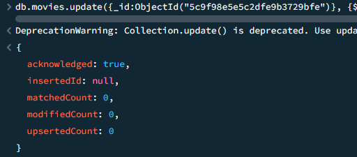
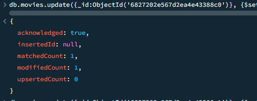
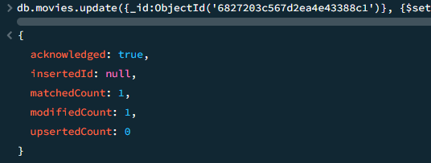
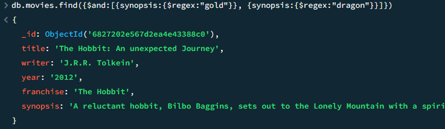

# Final Task 6

## Here's the Step-by-step process

#### Here's the following documents insert into a `movies` collection.

- db.movies.insert({title:"Fight Club", writer: "Chuck Palahniuk", year: "1999", actors:["Brad Pitt", "Edward Norton"]})
- db.movies.insert({title:"Pulp Fiction", writer:"Quentin Tarantino", year:"2009", actors:["John Travolta", "Uma Thurman"]})
- db.movies.insert({title:"Inglorious Basterds", writer:"Quentin Tarantino", year:"2009", actors:["Brad Pitt", "Diane Kruger", "Eli Roth"]})
- db.movies.insert({title:"The Hobbit: An unexpected Journey", writer:"J.R.R. Tolkein", year:"2012",franchise:"The Hobbit"})
- db.movies.insert({title:"The Hobbit: The Desolation of Smaug", writer:"J.R.R Tolkien", year:"2013", franchise:"The Hobbit"})
- db.movies.insert({title:"The Hobbit: The Battle of the Five Armies", writer:"J.R.R Tolkien", year:"2002", franchise:"The Hobbit", synopsis:"Bilbo and Company are forced to engage in a war against an array of combatants and keep the Lonely Mountain from falling into the hands of a rising darkness."})
- db.movies.insert({title:"Pee Wee Herman's Big Adventures"})
- db.movies.insert({title:"Avatar"})
#### Next is to find the following movie collection
- db.movies.find()  

#### Next is find the following movue collection to
- db.movies.find({writer:"Quentin Tarantino"})
- db.movies.find({actors:"Brad Pitt"})
- db.movies.find({franchise:"The Hobbit"})
- db.movies.find({year:{$gt:"1990", $lt:"2000"}})
- db.movies.find({$or:[{year:{$gt:"2010"}},{year: {$lt:"2000"}}]})
 

#### Next is update the following movie collection
- db.movies.update({_id:ObjectId("5c9f98e5e5c2dfe9b3729bfe")}, {$set:{synopsis:"A reluctant hobbit, Bilbo Baggins, sets out to the Lonely Mountain with a spirited group of dwarves to reclaim their mountain home - and the gold within it - from the dragon Smaug."}})
- db.movies.update({_id:ObjectId("5c9fa42ae5c2dfe9b3729c03")}, {$set:{synopsis:"The dwarves, along with Bilbo Baggins and Gandalf the Grey, continue their quest to reclaim Erebor, their homeland, from Smaug. Bilbo Baggins is in possession of a mysterious and magical ring."}})
- db.movies.update({_id:ObjectId("5c9f983ce5c2dfe9b3729bfc")}, {$push:{actors:"Samuel L. Jackson"}})
 

#### Next is find all movies that have a synopsis for example "Bilbo"
- db.movies.find({synopsis:{$regex:"Bilbo"}})
- db.movies.find({synopsis:{$regex:"Gandalf"}})
- db.movies.find({$and:[{synopsis:{$regex:"Bilbo"}}, {synopsis:{$not:/Gandalf/}}]})
- db.movies.find({$or:[{synopsis:{$regex:"dwarves"}}, {synopsis:{$regex:"hobbit"}}]})
- db.movies.find({$and:[{synopsis:{$regex:"gold"}}, {synopsis:{$regex:"dragon"}}]})
 

#### Next is delete the following documents
- db.movies.remove({_id:ObjectId("5c9f992ae5c2dfe9b3729c00")})
- db.movies.remove({_id:ObjectId("5c9f9936e5c2dfe9b3729c01")})
   

